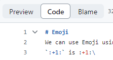

# Emoji
We can use Emoji using "\:EMOJICODE\:" like\
`:+1:` is :+1:\
But I think win + . is more easy and batter...haha..

# Paragraphs
We can create a new paragraph by leaving

between lines of text.

# Footnotes
`[^1]` is footnote1[^1].\
Footnotes will be appear down side of document.

[^1]: First footnote, you have to use same foot simbol twice.

# Alert
`> [!NOTE]` is
> [!NOTE]
> It is useful info

`> [!TIP]` is
> [!TIP]
> Helpful advice

`> [!IMPORTANT]` is
> [!IMPORTANT]
> Key info

`> [!WARNING]` is
> [!WARNING]
> Urgent info

`> [!CAUTION]` is
> [!CAUTION]
> Advises about risks

# Comment
If you want to hide content then use `<!-- -->` like HTML comment.
<!-- You can't see me~! -->

# Escaping
Use \\ for escape some md character.
But I think `(back qoute or backtick) is easier way to escape characters.

# Disabling MD rendering
If you select "Code" then you can disable rendering.
